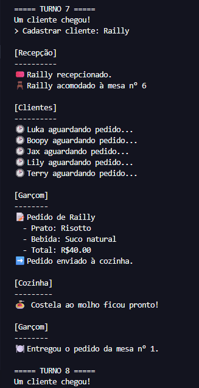

# 🍽️ Restaurant Simulator

> Simulação de um restaurante desenvolvida em Python,
> com foco em POO, design e arquitetura de software.

## 📝 Sobre

Projeto desenvolvido com foco no aprendizado e aplicação prática de conceitos de 
Programação Orientada a Objetos, princípios de design e arquitetura de software, 
utilizando uma simulação de restaurante como domínio.